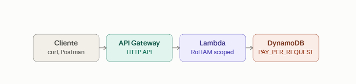
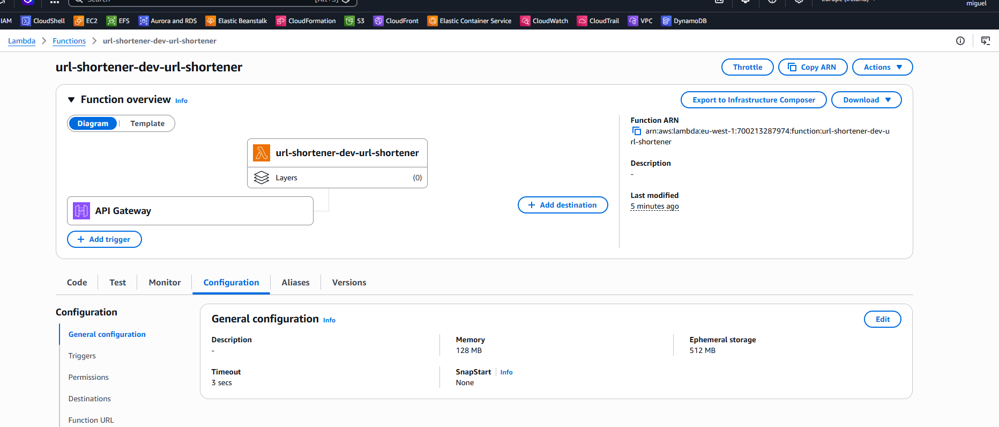
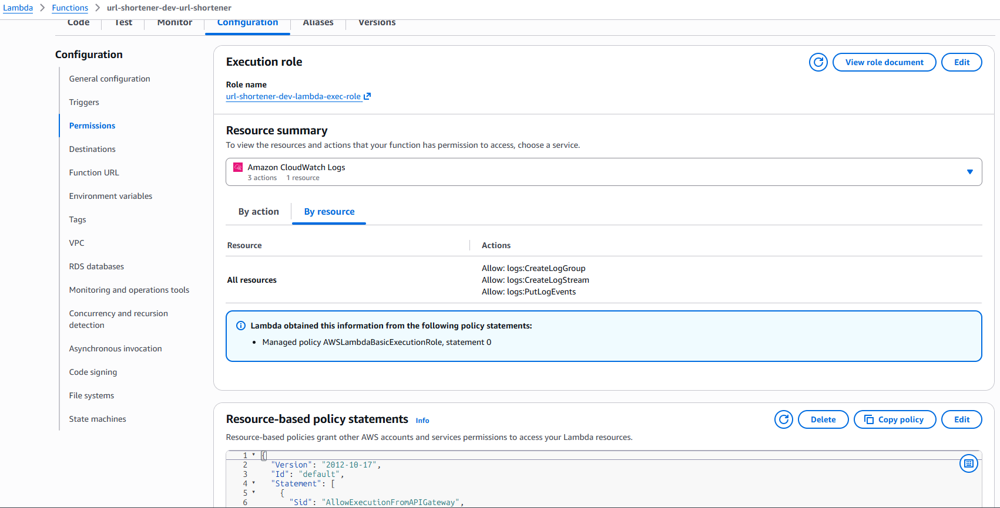
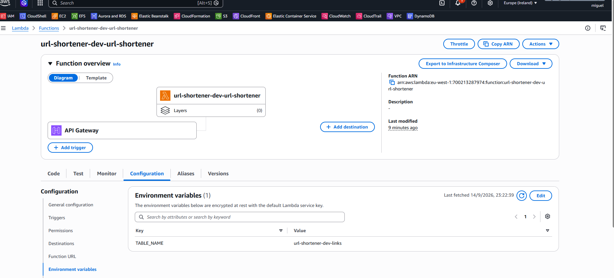
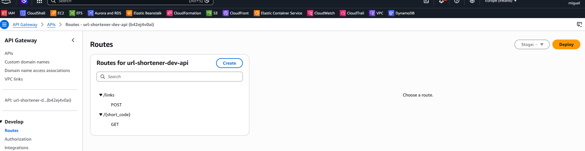
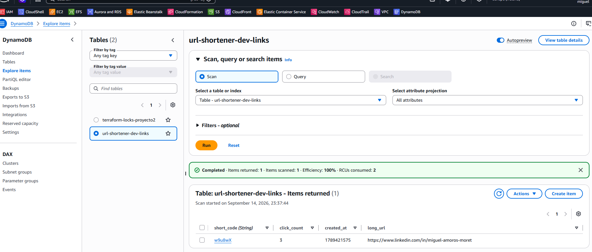
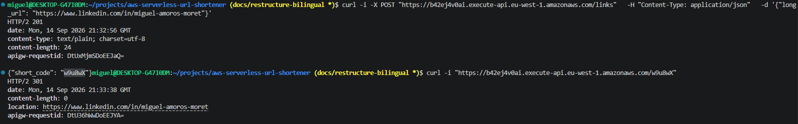
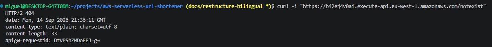
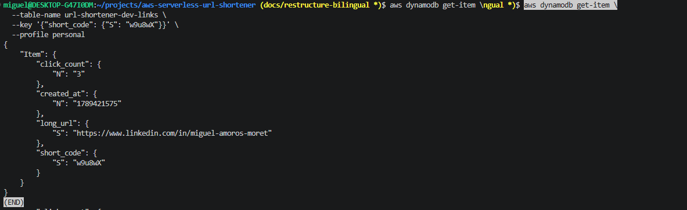

# AWS Serverless URL Shortener

+ API serverless de acortador de URLs construida con AWS Lambda, API Gateway (HTTP API) y DynamoDB, provisionada íntegramente con Terraform desde el inicio.

## Arquitectura


> Cliente → API Gateway (HTTP API) → Lambda (Python) → DynamoDB, con un rol IAM de permisos mínimos entre Lambda y DynamoDB, y CloudWatch Logs recogiendo tanto el acceso a la API como la ejecución de la función.

**Flujo de una petición:**

1. El cliente hace una petición HTTP a la URL pública de la API.
2. API Gateway recibe la petición y la reenvía a la Lambda mediante una integración `AWS_PROXY`.
3. La Lambda, bajo un rol IAM scoped, procesa la petición:
   - `POST /links` → genera un código corto y lo guarda en DynamoDB.
   - `GET /{short_code}` → busca el código, incrementa el contador de clics de forma atómica, y devuelve una redirección `301` a la URL original.
4. DynamoDB almacena y devuelve los datos.
5. CloudWatch Logs registra cada petición y cualquier error de ejecución.

## Cómo está montado

+ Todo el proyecto se provisiona con Terraform de principio a fin, sin ningún paso manual por consola:

- **Backend remoto**: reutiliza el bucket S3 (`miguel-terraform-state-proyecto2`) y la tabla de locks (`terraform-locks-proyecto2`) del Proyecto 2, aislando el state de este proyecto con `key = "proyecto3/terraform.tfstate"`.
- **`aws_dynamodb_table`**: tabla `links`, partition key `short_code`, modo `PAY_PER_REQUEST`, sin sort key.
- **`aws_iam_role` + `aws_iam_role_policy`**: rol de ejecución de Lambda con trust policy hacia `lambda.amazonaws.com` y permisos scoped a `GetItem`/`PutItem`/`UpdateItem` sobre el ARN exacto de la tabla, más `AWSLambdaBasicExecutionRole` para logs.
- **`archive_file` + `aws_lambda_function`**: código Python empaquetado automáticamente en un zip por Terraform, con `source_code_hash` para detectar cambios de código en cada `apply`.
- **`aws_apigatewayv2_api`**: HTTP API, protocolo `HTTP`.
- **`aws_apigatewayv2_integration`**: integración `AWS_PROXY` hacia la Lambda, con `payload_format_version = "1.0"`.
- **`aws_lambda_permission`**: permiso explícito para que API Gateway pueda invocar la función.
- **`aws_apigatewayv2_route`**: dos rutas, `POST /links` y `GET /{short_code}`, ambas apuntando a la misma integración.
- **`aws_apigatewayv2_stage`**: stage `$default` con `auto_deploy = true` y `access_log_settings` hacia un log group de CloudWatch con retención de 7 días.

+ Estructura de ficheros:
  ```
  aws-serverless-url-shortener/
  ├── providers.tf
  ├── backend.tf
  ├── variables.tf
  ├── terraform.tfvars.example
  ├── dynamodb.tf
  ├── iam.tf
  ├── lambda.tf
  ├── api_gateway.tf
  ├── api_gateway_stage.tf
  ├── outputs.tf
  ├── lambda/
  │   └── url_shortener/
  │       └── handler.py
  └── docs/
  ```

## Por qué lo monté así

+ **HTTP API en vez de REST API**: hasta un 70% más barato, más simple de configurar, y con `auto_deploy = true` no necesita gestión manual de deployments (a diferencia de REST API, que sí la requiere). Para una API sin API keys ni planes de uso, es la opción con mejor relación coste/complejidad.

+ **`PAY_PER_REQUEST` en DynamoDB**: el tráfico de un proyecto de portfolio es impredecible y mayormente nulo. Pagar por capacidad provisionada fija no tendría sentido aquí; en un entorno con tráfico estable y conocido, `PROVISIONED` con autoscaling puede salir más barato a largo plazo.

+ **Una única Lambda con enrutado interno ("fat Lambda")** en vez de una función por endpoint: con solo dos operaciones, separar en dos Lambdas añadía complejidad de despliegue (dos `archive_file`, dos integraciones) sin beneficio real. El patrón de una Lambda por ruta gana sentido en APIs con muchos endpoints gestionados por equipos distintos.

+ **`short_code` como partition key**: el patrón de acceso principal es "dado un código corto, obtener la URL larga" — una lectura directa por clave, la operación más eficiente en DynamoDB. La clave se diseña según cómo se va a consultar el dato, no según una convención de ID genérica.

+ **Contador de clics con `UpdateExpression = "ADD"`**: en vez de leer el valor, sumarle 1 en el código y volver a guardarlo (lo que generaría condiciones de carrera con tráfico concurrente), se usa el incremento atómico nativo de DynamoDB — la operación es segura aunque lleguen miles de peticiones simultáneas al mismo `short_code`.

+ **Backend remoto compartido con Proyecto 2**: simula el patrón habitual en empresas de una cuenta de "shared services" con backend de Terraform centralizado, donde cada proyecto aísla su state mediante una `key` distinta dentro del mismo bucket, en vez de duplicar bucket y tabla de locks por proyecto.

## Infraestructura desplegada y funcionando



*Función Lambda con el rol IAM asignado y runtime Python 3.12.*


*Variable de entorno `TABLE_NAME` inyectada desde Terraform, sin hardcodear en el código.*


*Las dos rutas (`POST /links`, `GET /{short_code}`) apuntando a la misma integración.*


*Ítem real creado durante las pruebas, con `click_count` incrementado.*

## Prueba de que funciona de verdad

```bash
# Crear una URL corta
curl -i -X POST "$API_URL/links" \
  -H "Content-Type: application/json" \
  -d '{"long_url": "https://www.linkedin.com/in/miguel-amoros-moret"}'
# → HTTP/2 201, body: {"short_code": "w9u8wX"}

# Visitar la URL corta
curl -i "$API_URL/w9u8wX"
# → HTTP/2 301, location: https://www.linkedin.com/in/miguel-amoros-moret
```


```bash
# Probar un código inexistente
curl -i "$API_URL/notexist"
# → HTTP/2 404, {"error": "short_code not found"}
```


```bash
# Verificar el contador de clics tras varias visitas
aws dynamodb get-item \
  --table-name url-shortener-dev-links \
  --key '{"short_code": {"S": "w9u8wX"}}' \
  --profile personal
# → click_count incrementado correctamente, sin pérdidas bajo visitas repetidas
```


## Lo que no salió a la primera y cómo lo arreglé (troubleshooting)

**1. `terraform init` fallaba con "No valid credential sources found"**
El bloque `backend "s3"` no puede leer variables de Terraform (`var.aws_profile`), porque se procesa antes de que las variables estén disponibles. Sin `profile` explícito, Terraform caía a la cadena de credenciales por defecto e intentaba usar IMDS (propio de instancias EC2), inexistente en WSL. Solución: añadir `profile = "personal"` como valor literal directamente en `backend.tf`.

**2. Warning `dynamodb_table` deprecado**
AWS provider recomienda migrar el locking a `use_lockfile` (nativo de S3). Se mantiene `dynamodb_table` intencionadamente por consistencia con el backend ya existente del Proyecto 2, que usa el mismo mecanismo — cambiarlo aquí generaría inconsistencia entre ambos proyectos sin beneficio real.

**3. La Lambda no interpretaba correctamente las peticiones de API Gateway**
Las HTTP API usan por defecto `payload_format_version = "2.0"`, cuya forma de evento (`event["requestContext"]["http"]["method"]`) es distinta del formato clásico que asume el código (`event["httpMethod"]`, `event["path"]`). Solución: fijar explícitamente `payload_format_version = "1.0"` en la integración, compatible con el formato de evento que ya usa el handler.

## Stack

| Componente | Servicio AWS | Detalle |
|---|---|---|
| Cómputo | AWS Lambda | Python 3.12 |
| API pública | API Gateway | HTTP API (v2) |
| Base de datos | DynamoDB | Tabla `links`, `PAY_PER_REQUEST` |
| Permisos | IAM | Rol scoped, mínimo privilegio |
| Observabilidad | CloudWatch Logs | Logs de acceso (API Gateway) y de ejecución (Lambda) |
| IaC | Terraform | Backend remoto S3 + DynamoDB, compartido con Proyecto 2 |

## Estado

+ ✅ Proyecto completo — Bloques 0 a 10 finalizados: diseño, infraestructura, código, integración, pruebas end-to-end y documentación.

+ Infraestructura destruida tras la documentación final (`terraform destroy`) para evitar costes innecesarios. Se puede recrear en minutos con `terraform apply` siguiendo los pasos de despliegue.


## Despliegue

+ Clonación del repositorio:
  ```bash
  git clone git@github.com:mamoros-dev/aws-serverless-url-shortener.git
  cd aws-serverless-url-shortener

  cp terraform.tfvars.example terraform.tfvars

  terraform init
  terraform plan
  terraform apply

  terraform output api_endpoint
  ```

+ Para destruir la infraestructura:
  ```bash
  terraform destroy
  ```


## Autor

+ Miguel — [GitHub](https://github.com/mamoros-dev) · [LinkedIn](https://www.linkedin.com/in/miguel-amoros-moret/)
